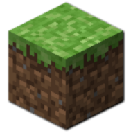

# World of Adam

Adam is the first man on the planet, help him build his world and adapt in order to create a better world for himself.

World of Adam is a replica of Minecraft with little features. This website was created to explore the 3-dimensional powers of three.js.

Three.js is a Web Graphics Library that is used to created 3-dimensional website layouts.

### Visit :- [World of Adam](https://worldofadam.netlify.app/)

## Tech Stack

Typescript - React - CSS - Three.js - React-Fiber - Netlify



## Install

Download the code of this project or clone it to your machine

After you get your copy, hit the command below to install all the dependencies that I have used for this project

```bash
npm install
```

After the command above has finished installing all the dependencies, hit the following commands

```bash
cd client/
npm install
```

Now you can successfully run the project locally

## About the Developer

### Hey, this is Angkush

Contact Me from [here](https://angkush.vercel.app#contact)

<a href="https://angkush.vercel.app/" rel="noopener noreferrer" target="_blank">
  
</a>

<a href="https://linkedin.com/in/angkush-sahu-0409311bb" rel="noopener noreferrer" target="_blank">
  
</a>

<a href="https://angkush.vercel.app/contact" rel="noopener noreferrer" target="_blank">
  
</a>

<a href="https://github.com/angkushsahu" rel="noopener noreferrer" target="_blank">
  
</a>
